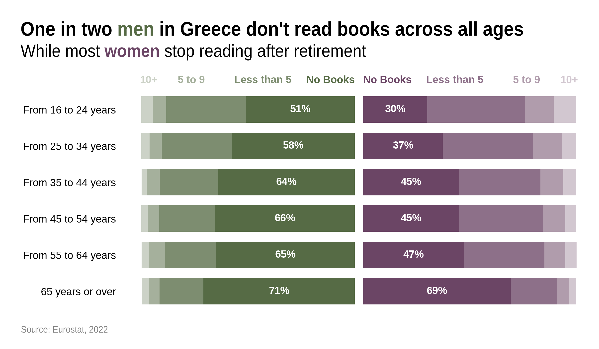

# Book Reading in Greece

This project uses Eurostat's book reading habits survey for Greece, visualizing them into a diverging stacked bar chart. 
The chart is divided into **sex** and **reading frequency**, giving a clear comparative view of how different age groups engage with reading.

## About the Chart

- Data Source: Eurostat
- Age Groups: 16–24, 25–34, 35–44, 45-54, 55-64, 65+
- Categories:
  - No Books
  - Less than 5
  - 5 to 9
  - 10+
- Male and female responses are visualized on opposite sides for easy comparison.
- Custom color palettes highlight gender-specific trends.

## Files

- `book_reading_chart.ipynb`: Jupyter notebook with code and chart
- `book_reading_chart.png`: Exported image of the final chart
- `book_reading_chart.psd`: Photoshop version for editing

## How to Run

Make sure you have the following Python libraries installed:

pip install matplotlib seaborn pandas numpy
